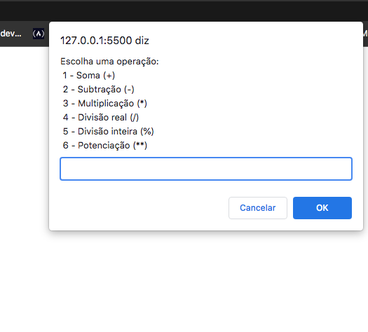

# Calculadora

Projeto criado para treinar as skills básicas de javascript. Um projeto muito bom para treinar as lógicas matemáticas, condições e funções.

# Exemplo

## Aqui inicia-se a função e seleciona qual operação deseja fazer.

## Após selecionar a operação já poderá colocar o primeiro valor e em seguida o segundo valor

 

## Logo em seguida de colocar os valores da operação desejada já irá aparecer o resultado na tela.

## Ao clicar em 'OK' após aparecer o resultado irá aparecer uma opção se deseja fazer uma nova operação.  Se selecionar sim voltará no começo da calculadora, se não irá aparecer esse balão.

 

# Autor

Feito por Alexandre Junior. [Veja meu LinkedIn](https://www.linkedin.com/in/alexandrejuniorc/)
